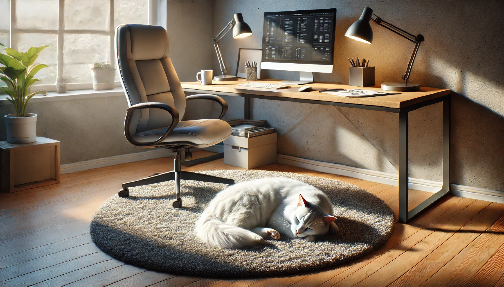

# Gato branco no trabalho

## 📒 Descrição
É a imagem de um gato branco dormindo em um tapete sob a mesa de um escritório em uma tarde de trabalho

## 🤖 Tecnologias Utilizadas
Foi utilizado o Dall-E para fazer a geração da imagem.

## 🧐 Processo de Criação
Foi feita a descrição da ideia para a IA generativa, que fez a geração da imagem. Foram feitos alguns retoques para minimizar os erros de geração através da prória interface do Dall-E.

## 🚀 Resultados
A imagem gerada: 

## 💭 Reflexão (Opcional)
A velocidade do avanço das IAs generativas é impressionante. Ainda há bastante espaço para desenvolvimento, mas a tecnologia atual resultado já apresenta resultados satisfatórios.